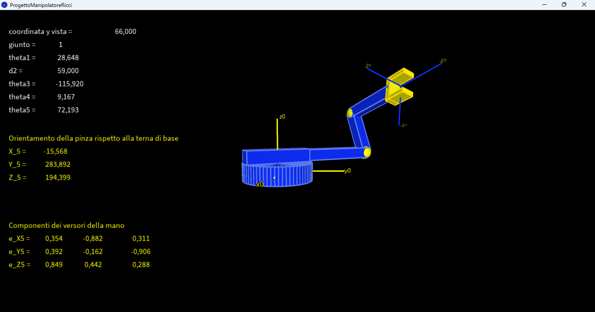

# 5-DOF Robotic Manipulator – Forward Kinematics in Processing

## Descrizione
Questo progetto implementa la modellazione e la simulazione di un manipolatore robotico a 5 gradi di libertà utilizzando Processing.

Il sistema consente la visualizzazione 3D del robot e l’implementazione della cinematica diretta, con interazione in tempo reale sui giunti e visualizzazione completa dello stato del manipolatore.

## Obiettivi del progetto
- Disegnare un manipolatore a 5 gradi di libertà
- Implementare la cinematica diretta
- Permettere il controllo interattivo dei giunti
- Visualizzare frame di riferimento e stato del sistema in tempo reale
- Introdurre vincoli cinematici realistici su alcuni giunti

## Struttura del robot
Il manipolatore è composto da:
- Base (link 0)
- 5 giunti:
  - θ1 (rotazione base)
  - d2 (giunto prismatico)
  - θ3 (rotazione)
  - θ4 (rotazione con vincolo)
  - θ5 (polso / end-effector)
- End-effector (pinza semplificata)

I link sono rappresentati come parallelepipedi per semplicità geometrica.

## Controlli

- Tasti `1–5` → selezione del giunto attivo
- Frecce `← →` → movimento del giunto selezionato
- Mouse click → traslazione della base del robot
- Frecce `↑ ↓` → modifica della vista verticale della scena

## Cinematica diretta

Il sistema calcola in tempo reale:
- posizione dell’end-effector (O₅ rispetto alla base)
- orientamento della pinza (versori x₅, y₅, z₅ espressi nel frame base)

## Vincoli cinematici

- **d₂ (giunto prismatico)**:
  - vincolato per evitare la separazione dei link e collisioni interne
- **θ₄ (giunto rotazionale)**:
  - vincolato per evitare sovrapposizione tra link 3 e link 4
- Il robot può attraversare il piano di appoggio (collisioni ignorate)

## Visualizzazione

Durante la simulazione vengono mostrati in tempo reale:
- valori dei giunti (θ₁, d₂, θ₃, θ₄, θ₅) in gradi (−180° / +180° per visualizzazione)
- coordinate dell’end-effector O₅
- versori del frame finale (x₅, y₅, z₅)
- sistemi di riferimento:
  - base (x₀, y₀, z₀)
  - end-effector (x₅, y₅, z₅)

## Implementazione

Il progetto è sviluppato in:
- Processing (Java-based environment)
- Modellazione geometrica con primitive 3D
- Cinematica diretta basata su trasformazioni omogenee

## Limitazioni: non previste però dalle specifiche di progetto

- Collisioni tra robot e piano di appoggio non modellate
- Pinza semplificata (senza cinematica propria)
- Modello puramente cinematico (assenza di dinamica)

---

## Autore
Simonetta Ricci

---

## Note
Progetto individuale sulla cinematica diretta e la simulazione di manipolatori robotici, sviluppato durante la laurea triennale.
